# Test System API - Complete System Documentation

## Table of Contents

1. [System Overview](#system-overview)
2. [Architecture Diagrams](#architecture-diagrams)
3. [Sequence Flow Diagrams](#sequence-flow-diagrams)
4. [API Specification](#api-specification)
5. [Data Flow Analysis](#data-flow-analysis)
6. [Error Handling Flows](#error-handling-flows)
7. [Implementation Details](#implementation-details)
8. [Testing & Validation](#testing--validation)
9. [Deployment & Configuration](#deployment--configuration)

---

## System Overview

### Purpose
The Test System API is a MuleSoft-based System API designed for direct KYC (Know Your Customer) data access and basic validation. It serves as a foundational layer in a MuleSoft architecture, providing secure and reliable access to customer verification data.

### Key Characteristics
- **API Type:** System API (Direct data access layer)
- **Runtime:** MuleSoft 4.4.0
- **Architecture Pattern:** RAML-first design with APIKit
- **Primary Function:** KYC data validation and processing
- **Integration Layer:** System layer in MuleSoft's API-led connectivity

### Technical Stack
```
┌─────────────────────────────────────────┐
│           Client Applications           │
├─────────────────────────────────────────┤
│              HTTP/JSON                  │
├─────────────────────────────────────────┤
│         Test System API (Port 8082)     │
│    ┌─────────────────────────────────┐   │
│    │        APIKit Router            │   │
│    │   ┌─────────────────────────┐   │   │
│    │   │    KYC Subflow          │   │   │
│    │   │  ┌─────────────────┐    │   │   │
│    │   │  │ Business Logic  │    │   │   │
│    │   │  └─────────────────┘    │   │   │
│    │   └─────────────────────────┘   │   │
│    └─────────────────────────────────┘   │
├─────────────────────────────────────────┤
│           MuleSoft Runtime 4.4.0        │
└─────────────────────────────────────────┘
```

---

## Architecture Diagrams

### 1. High-Level System Architecture

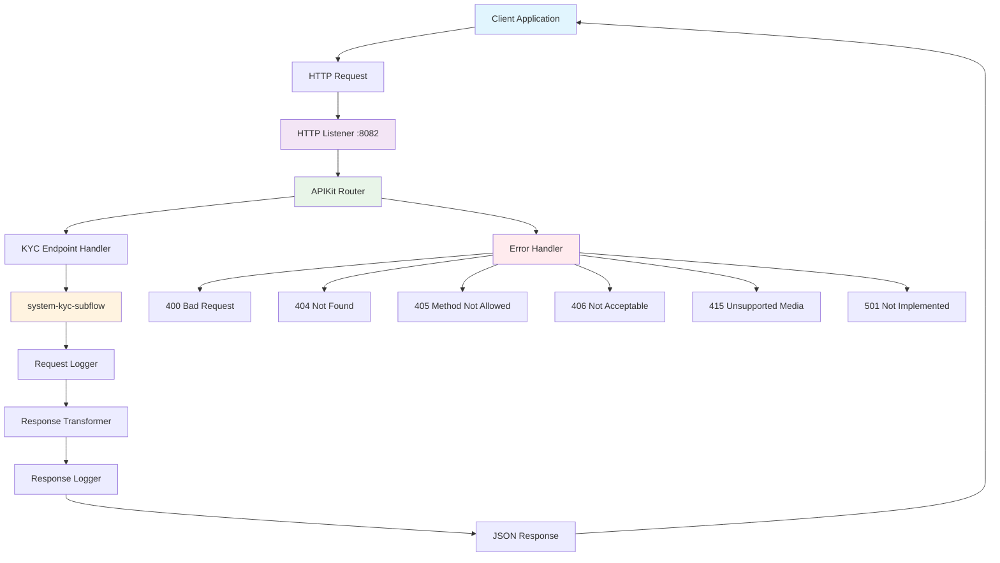

### 2. MuleSoft Flow Architecture

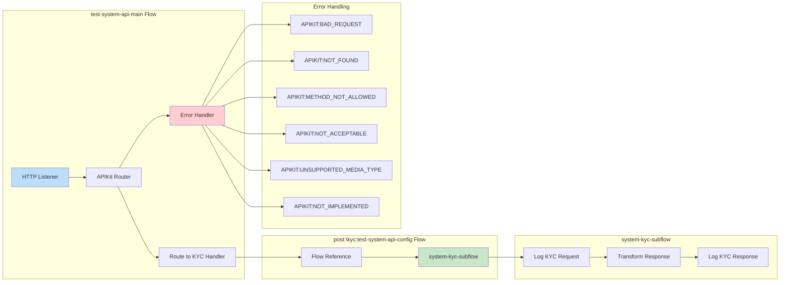

### 3. Component Interaction Diagram

```mermaid
graph TD
    subgraph "External Layer"
        Client[Client Application]
    end
    
    subgraph "API Layer"
        HTTPListener[HTTP Listener<br/>Port: 8082<br/>Path: /test-system-api/*]
        APIKitRouter[APIKit Router<br/>RAML: test-system-api.raml]
    end
    
    subgraph "Flow Layer"
        KYCFlow[KYC Endpoint Flow<br/>post:\kyc:test-system-api-config]
        KYCSubflow[KYC Subflow<br/>system-kyc-subflow]
    end
    
    subgraph "Processing Layer"
        RequestLogger[Request Logger<br/>Account: #[payload.account]]
        ResponseTransformer[Response Transformer<br/>DataWeave 2.0]
        ResponseLogger[Response Logger<br/>Success Message]
    end
    
    subgraph "Configuration Layer"
        RAML[RAML Specification<br/>test-system-api.raml]
        DataTypes[Data Types Library<br/>data-types.raml]
        Traits[Traits Library<br/>traits.raml]
    end
    
    Client --> HTTPListener
    HTTPListener --> APIKitRouter
    APIKitRouter --> KYCFlow
    KYCFlow --> KYCSubflow
    KYCSubflow --> RequestLogger
    RequestLogger --> ResponseTransformer
    ResponseTransformer --> ResponseLogger
    
    APIKitRouter -.-> RAML
    RAML -.-> DataTypes
    RAML -.-> Traits
    
    style Client fill:#e3f2fd
    style HTTPListener fill:#f1f8e9
    style APIKitRouter fill:#fff8e1
    style KYCSubflow fill:#fce4ec
    style RAML fill:#f3e5f5
```

---

## Sequence Flow Diagrams

### 1. Successful KYC Request Flow

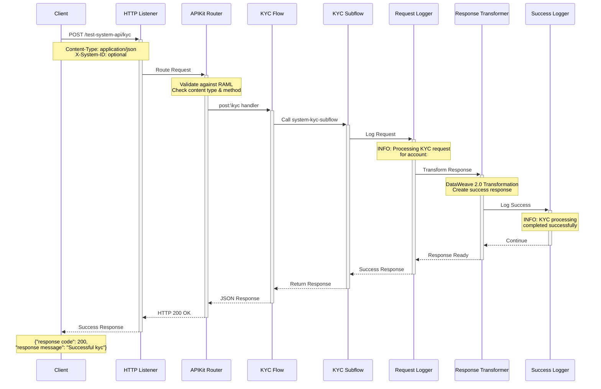

### 2. Error Handling Flow

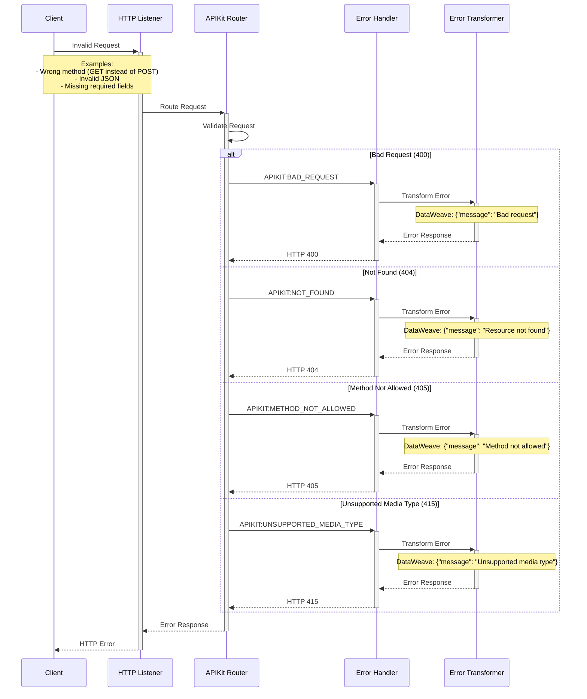

### 3. Request Validation Flow

```mermaid
sequenceDiagram
    participant C as Client
    participant AR as APIKit Router
    participant RAML as RAML Validator
    participant DT as Data Types
    participant TR as Traits
    
    C->>+AR: POST /test-system-api/kyc
    
    AR->>+RAML: Validate Request
    RAML->>+DT: Check KycRequest Schema
    
    Note over DT: Validate Required Fields:<br/>- account (string)<br/>- First Name (string)<br/>- Last Name (string)<br/>- amount (number)<br/>- currency (string)<br/>- Birthday (string)
    
    DT->>+TR: Check Traits
    Note over TR: Apply Traits:<br/>- jsonBody<br/>- standardResponse<br/>- systemHeaders
    
    alt Valid Request
        TR-->>-DT: Validation Passed
        DT-->>-RAML: Schema Valid
        RAML-->>-AR: Request Valid
        AR->>AR: Route to Handler
    else Invalid Request
        TR-->>-DT: Validation Failed
        DT-->>-RAML: Schema Invalid
        RAML-->>-AR: Validation Error
        AR->>AR: Trigger Error Handler
    end
```

---

## API Specification

### Endpoint Details

#### POST /kyc

**Purpose:** System API for direct KYC data access and basic validation

**Request Specification:**
```yaml
Method: POST
Path: /test-system-api/kyc
Content-Type: application/json
Headers:
  X-System-ID: string (optional) - System identifier for tracking
```

**Request Schema (KycRequest):**
```json
{
  "type": "object",
  "required": ["account", "First Name", "Last Name", "amount", "currency", "Birthday"],
  "properties": {
    "account": {
      "type": "string",
      "description": "Account number",
      "example": "019231203"
    },
    "First Name": {
      "type": "string",
      "description": "Customer first name",
      "example": "Katie"
    },
    "Last Name": {
      "type": "string",
      "description": "Customer last name", 
      "example": "Hunter"
    },
    "amount": {
      "type": "number",
      "format": "double",
      "description": "Transaction amount",
      "example": 100.00
    },
    "currency": {
      "type": "string",
      "description": "Currency code",
      "example": "PHP"
    },
    "Birthday": {
      "type": "string",
      "description": "Date of birth in MM-DD-YYYY format",
      "example": "10-30-1992"
    }
  }
}
```

**Response Schema (KycResponse):**
```json
{
  "type": "object",
  "properties": {
    "response code": {
      "type": "integer",
      "description": "HTTP response code",
      "example": 200
    },
    "response message": {
      "type": "string",
      "description": "Response message",
      "example": "Successful kyc"
    }
  }
}
```

### HTTP Status Codes

| Code | Description | Response Body |
|------|-------------|---------------|
| 200 | Success | KycResponse object |
| 400 | Bad Request | `{"message": "Bad request"}` |
| 404 | Not Found | `{"message": "Resource not found"}` |
| 405 | Method Not Allowed | `{"message": "Method not allowed"}` |
| 406 | Not Acceptable | `{"message": "Not acceptable"}` |
| 415 | Unsupported Media Type | `{"message": "Unsupported media type"}` |
| 500 | Internal Server Error | `{"message": "Internal server error"}` |
| 501 | Not Implemented | `{"message": "Not Implemented"}` |

---

## Data Flow Analysis

### 1. Request Data Flow

```mermaid
graph LR
    subgraph "Input Validation"
        A[Raw JSON Request] --> B[RAML Validation]
        B --> C[Schema Validation]
        C --> D[Type Checking]
    end
    
    subgraph "Processing Pipeline"
        D --> E[Extract Account Info]
        E --> F[Log Request Details]
        F --> G[Business Logic Processing]
        G --> H[Response Generation]
    end
    
    subgraph "Output Generation"
        H --> I[DataWeave Transformation]
        I --> J[JSON Response]
        J --> K[Success Logging]
    end
    
    style A fill:#ffebee
    style D fill:#e8f5e8
    style H fill:#e3f2fd
    style K fill:#f1f8e9
```

### 2. Data Transformation Points

```mermaid
graph TD
    subgraph "Input Layer"
        A[Client JSON Request]
        A1[account: "019231203"]
        A2[First Name: "Katie"]
        A3[Last Name: "Hunter"]
        A4[amount: 100.00]
        A5[currency: "PHP"]
        A6[Birthday: "10-30-1992"]
    end
    
    subgraph "Validation Layer"
        B[RAML Schema Validation]
        B1[Required Field Check]
        B2[Data Type Validation]
        B3[Format Validation]
    end
    
    subgraph "Processing Layer"
        C[Business Logic]
        C1[Account Extraction]
        C2[Request Logging]
        C3[Success Processing]
    end
    
    subgraph "Output Layer"
        D[Response Generation]
        D1[response code: 200]
        D2[response message: "Successful kyc"]
    end
    
    A --> B
    A1 --> B1
    A2 --> B1
    A3 --> B1
    A4 --> B2
    A5 --> B2
    A6 --> B3
    
    B --> C
    B1 --> C1
    B2 --> C2
    B3 --> C3
    
    C --> D
    C1 --> D1
    C2 --> D2
    C3 --> D2
    
    style A fill:#e1f5fe
    style B fill:#f3e5f5
    style C fill:#e8f5e8
    style D fill:#fff3e0
```

### 3. Logging Data Flow

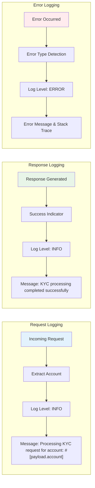

---

## Error Handling Flows

### 1. Error Classification Diagram

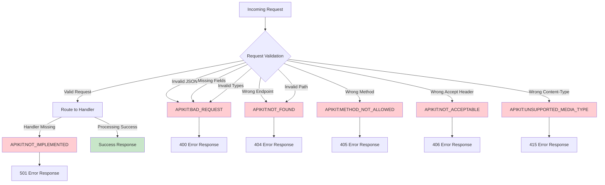

### 2. Error Response Generation Flow

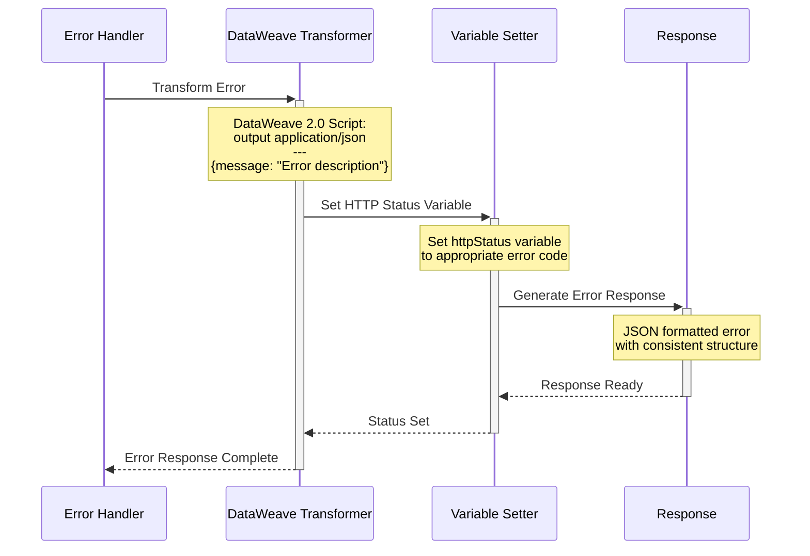

### 3. Error Handling Decision Tree

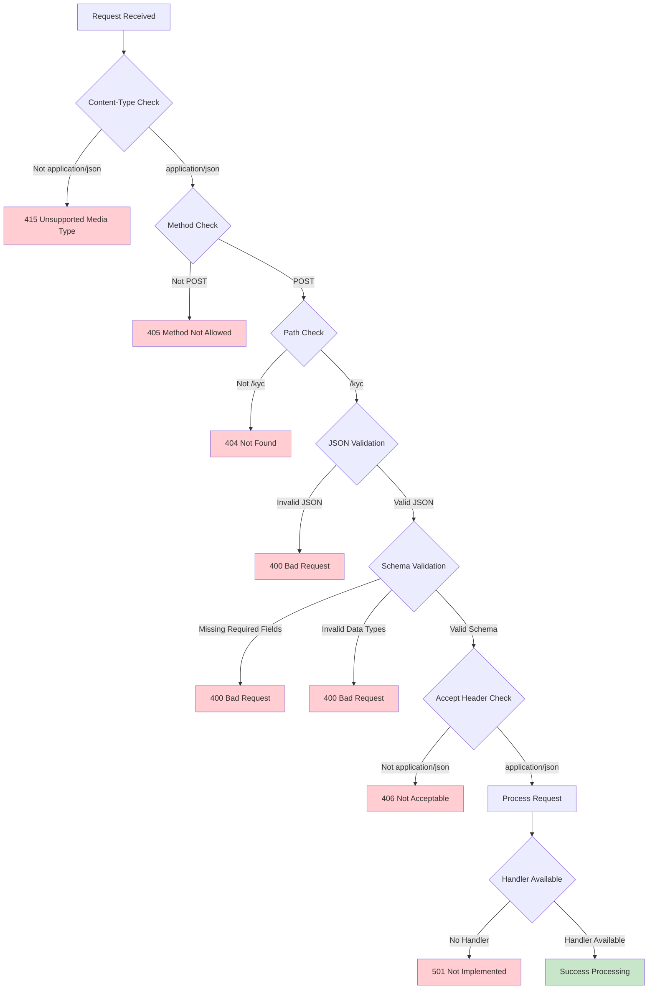

---

## Implementation Details

### 1. MuleSoft Configuration Structure

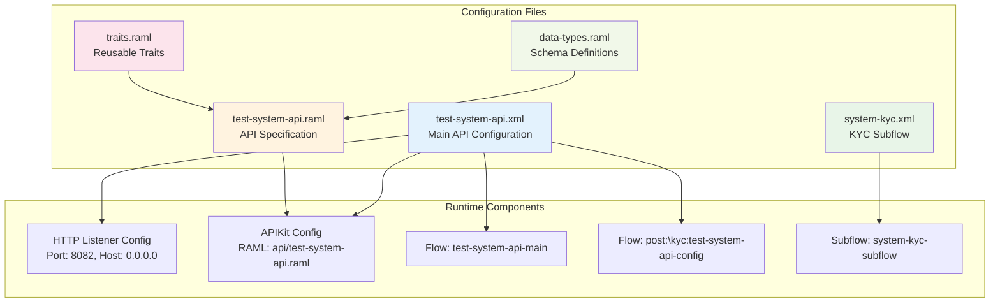

### 2. Flow Execution Model

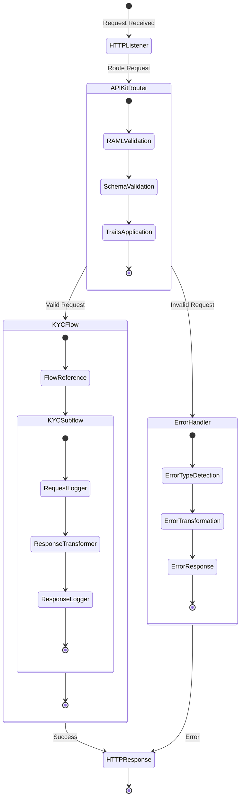

### 3. DataWeave Transformation Details

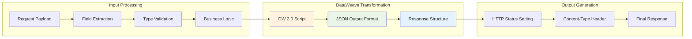

**DataWeave Script Details:**
```dataweave
%dw 2.0
output application/json
---
{
  "response code": 200,
  "response message": "Successful kyc"
}
```

---

## Testing & Validation

### 1. MUnit Test Architecture

```mermaid
graph TB
    subgraph "Test Configuration"
        A[system-kyc-test.xml]
        B[MUnit Config]
        C[Test Dependencies]
    end
    
    subgraph "Test Cases"
        D[test-valid-kyc-request]
        E[test-kyc-request-with-different-account]
    end
    
    subgraph "Test Execution Flow"
        F[Set Test Payload]
        G[Call system-kyc-subflow]
        H[Assert Response Code = 200]
        I[Assert Response Message = "Successful kyc"]
    end
    
    subgraph "Test Data"
        J[Test Case 1:<br/>Katie Hunter<br/>Account: 019231203]
        K[Test Case 2:<br/>John Doe<br/>Account: 987654321]
    end
    
    A --> B
    B --> D
    B --> E
    D --> F
    E --> F
    F --> G
    G --> H
    H --> I
    
    J --> D
    K --> E
    
    style D fill:#e8f5e8
    style E fill:#e8f5e8
    style H fill:#c8e6c9
    style I fill:#c8e6c9
```

### 2. Test Execution Sequence

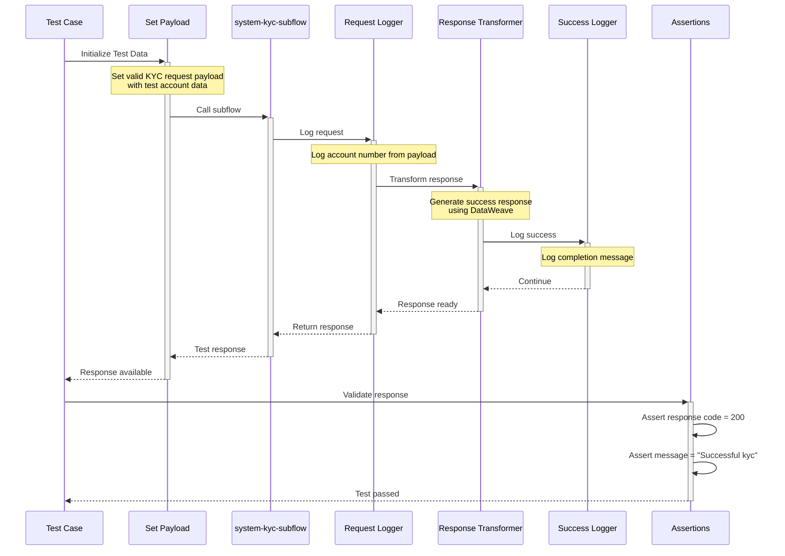

### 3. Test Coverage Matrix

| Test Scenario | Input Data | Expected Output | Validation Points |
|---------------|------------|-----------------|-------------------|
| **Valid KYC Request #1** | Katie Hunter, Account: 019231203 | HTTP 200, Success message | Response code, Response message |
| **Valid KYC Request #2** | John Doe, Account: 987654321 | HTTP 200, Success message | Response code, Response message |
| **Invalid JSON** | Malformed JSON | HTTP 400, Bad request | Error handling |
| **Missing Fields** | Incomplete payload | HTTP 400, Bad request | Schema validation |
| **Wrong Method** | GET instead of POST | HTTP 405, Method not allowed | Method validation |
| **Wrong Content-Type** | text/plain | HTTP 415, Unsupported media | Content type validation |

---

## Deployment & Configuration

### 1. Deployment Architecture

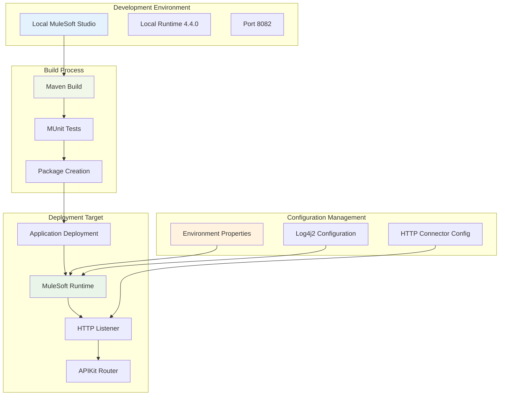

### 2. Configuration Parameters

| Parameter | Value | Description | Environment |
|-----------|-------|-------------|-------------|
| **HTTP Host** | 0.0.0.0 | Listener host address | All |
| **HTTP Port** | 8082 | Listener port | Development |
| **Base URI** | /test-system-api | API base path | All |
| **RAML Location** | api/test-system-api.raml | API specification | All |
| **Log Level** | INFO | Default logging level | Development |
| **Runtime Version** | 4.4.0 | MuleSoft runtime | All |

### 3. Environment Configuration Flow

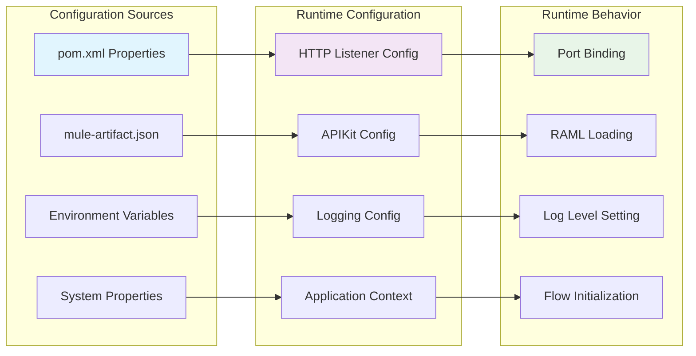

---

## Monitoring & Observability

### 1. Logging Flow

```mermaid
graph TD
    subgraph "Request Logging"
        A[Request Received] --> B[Extract Account Info]
        B --> C[Log Request Details]
        C --> D[INFO Level Log]
    end
    
    subgraph "Processing Logging"
        E[Business Logic Start] --> F[Processing Steps]
        F --> G[Success/Error Logging]
        G --> H[INFO/ERROR Level]
    end
    
    subgraph "Response Logging"
        I[Response Generated] --> J[Log Response Status]
        J --> K[Success Completion Log]
        K --> L[INFO Level Log]
    end
    
    subgraph "Error Logging"
        M[Error Occurred] --> N[Error Type Detection]
        N --> O[Stack Trace Capture]
        O --> P[ERROR Level Log]
    end
    
    style D fill:#e8f5e8
    style H fill:#fff3e0
    style L fill:#e8f5e8
    style P fill:#ffcdd2
```

### 2. Performance Metrics

| Metric | Measurement Point | Purpose |
|--------|------------------|---------|
| **Request Count** | HTTP Listener | Track API usage |
| **Response Time** | End-to-end flow | Performance monitoring |
| **Error Rate** | Error handlers | Quality monitoring |
| **Throughput** | Concurrent requests | Capacity planning |
| **Success Rate** | Successful responses | Reliability tracking |

### 3. Health Check Flow

```mermaid
sequenceDiagram
    participant M as Monitoring System
    participant API as Test System API
    participant HL as HTTP Listener
    participant H as Health Check
    
    M->>+API: GET /test-system-api/health
    API->>+HL: Route health check
    HL->>+H: Process health request
    
    H->>H: Check system status
    H->>H: Validate dependencies
    H->>H: Check resource availability
    
    H-->>-HL: Health status
    HL-->>-API: Health response
    API-->>-M: 200 OK / 503 Service Unavailable
    
    Note over M,H: Health check includes:<br/>- API availability<br/>- Runtime status<br/>- Resource health
```

---

## Appendices

### A. RAML Specification Complete

```yaml
#%RAML 1.0
title: Test System API
version: v1
baseUri: /test-system-api

uses:
  DataTypes: libraries/data-types.raml
  Traits: libraries/traits.raml

/kyc:
  post:
    displayName: System KYC Data Access
    description: System API for direct KYC data access and basic validation
    is: [Traits.jsonBody, Traits.standardResponse, Traits.systemHeaders]
    body:
      application/json:
        type: DataTypes.KycRequest
    responses:
      200:
        body:
          application/json:
            type: DataTypes.KycResponse
```

### B. Complete Data Types

```yaml
#%RAML 1.0 Library

types:
  KycRequest:
    type: object
    properties:
      account:
        type: string
        example: "019231203"
        required: true
        description: Account number
      "First Name":
        type: string
        example: "Katie"
        required: true
        description: Customer first name
      "Last Name":
        type: string
        example: "Hunter"
        required: true
        description: Customer last name
      amount:
        type: number
        format: double
        example: 100.00
        required: true
        description: Transaction amount
      currency:
        type: string
        example: "PHP"
        required: true
        description: Currency code
      Birthday:
        type: string
        example: "10-30-1992"
        required: true
        description: Date of birth in MM-DD-YYYY format

  KycResponse:
    type: object
    properties:
      "response code":
        type: integer
        example: 200
        description: HTTP response code
      "response message":
        type: string
        example: "Successful kyc"
        description: Response message
```

### C. Complete Traits Definition

```yaml
#%RAML 1.0 Library

traits:
  standardResponse:
    responses:
      200:
        description: Success
      400:
        description: Bad Request
        body:
          application/json:
            example:
              message: "Bad request"
      404:
        description: Not Found
        body:
          application/json:
            example:
              message: "Resource not found"
      500:
        description: Internal Server Error
        body:
          application/json:
            example:
              message: "Internal server error"

  jsonBody:
    body:
      application/json:

  systemHeaders:
    headers:
      X-System-ID:
        type: string
        required: false
        description: System identifier for data access tracking
```

---

**Document Version:** 2.0  
**Last Updated:** August 2025  
**API Version:** v1  
**MuleSoft Runtime:** 4.4.0  
**Documentation Type:** Complete System Documentation with Diagrams and Sequence Flows
